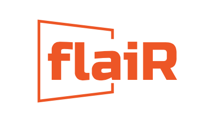

#  `flairR`: An R Wrapper for Accessing Flair NLP Tagging Features 


<div style="text-align: justify">


flairR is R wrapper, built upon the reticulate architecture, offers streamlined access to the core features of FlairNLP in Python. FlairNLP is an advanced framework incorporating the latest techniques in Natural Language Processing developed by [Humboldt University of Berlin](https://github.com/flairNLP/flair). For a deeper understanding of Flair's training model architecture, please consult the article '[Contextual String Embeddings for Sequence Labeling](https://aclanthology.org/C18-1139.pdf)' and the official [mannual](https://flairnlp.github.io). The stable features currently available in `flairR` includes __part-of-speech tagging__, __transformer-based sentiment analysis__, and __named entity recognition__. 

</div>

## Installation
"The installation consists of two parts: First, install Python and then download the package. Create an environment within the R setting and interface with Flair.

### Get Started with `remotes`:

```
install.packages("remotes")
remotes::install_github("davidycliao/flair", force = TRUE)
```

```
library(flaiR)
## flaiR: An R Wrapper for Accessing Flair NLP Tagging Features ##
## Using Python:    3.8                                         ##
## Using Flair : 0.12.2                                         ##
```


### Lazy Installation for the Enviroment

`create_flair_env` automatically creates a new conda environment specifically in
the R session, and installs `flair`.

```
create_flair_env()
```

### Or, Install Python `flair` Uisng `reticulate` in R

Use the reticulate package in R to create a conda environment named  `flair_env` 
and install Python's `flair`.

```
reticulate::conda_create("flair_env")  
reticulate::conda_install("flair_env", packages = "flair")  
```


##  Cite the Work of `Flair`
```
@inproceedings{akbik2018coling,
  title={Contextual String Embeddings for Sequence Labeling},
  author={Akbik, Alan and Blythe, Duncan and Vollgraf, Roland},
  booktitle = {{COLING} 2018, 27th International Conference on Computational Linguistics},
  pages     = {1638--1649},
  year      = {2018}
}
```


