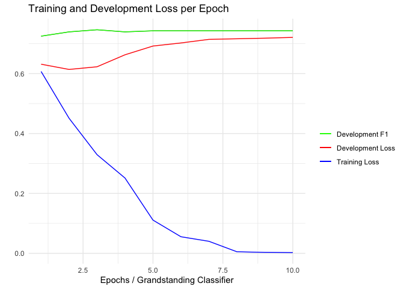

## <u>`flairR`</u>: An R Wrapper for Accessing Flair NLP Library 

[](https://github.com/davidycliao/flaiR/actions/workflows/r_macos.yml)
[](https://github.com/davidycliao/flaiR/actions/workflows/r_ubuntu.yaml)
[](https://github.com/davidycliao/flaiR/actions/workflows/r_window.yml)

[](https://github.com/davidycliao/flaiR/actions/workflows/r.yml)
[](https://github.com/davidycliao/flaiR/actions/workflows/test-coverage.yaml)
[](https://codecov.io/gh/davidycliao/flaiR)
[](https://www.codefactor.io/repository/github/davidycliao/flair)

<!-- README.md is generated from README.Rmd. Please edit that file -->
<div style="text-align: justify">
&#10;
{flaiR} is an R wrapper for the {flairNLP/flair} Python library,
specifically tailored for R users, particularly in political science and
the social sciences. flaiR provides easy access to the main
functionalities of Flair NLP. Developed by Developed by [Zalando
Research](https://engineering.zalando.com/posts/2018/11/zalando-research-releases-flair.html)
in Berlin, flair NLP is a straightforward framework for state-of-the-art
Natural Language Processing (NLP) and is compatible with Hugging Face.
Flair offers intuitive interfaces and exceptional multilingual support,
particularly for various embedding models, transformers and
state-of-the-art NLP tasks to analyze texts, such as named entity
recognition, sentiment analysis, part-of-speech tagging, with support
for a rapidly growing number of language models in the community.

For a comprehensive understanding of the `{flairNLP/flair}` architecture
and NLP tagging models by [Zalando
Research](https://engineering.zalando.com/posts/2018/11/zalando-research-releases-flair.html),
you can refer to the research article ‘[Contextual String Embeddings for
Sequence Labeling](https://aclanthology.org/C18-1139.pdf)’ and the
official [manual](https://flairnlp.github.io) written for its Python
implementation.

{flaiR} unofficial platform provides R users with documentation,
examples, and tutorials for using Flair NLP. The goal is to make it
easier for R users to access the powerful NLP tools provided by Flair
NLP.

## Tutorial Updates

<br>

## Installation via <u>**`GitHub`**</u>

<div style="text-align: justify">

The installation consists of two parts: First, install [Python
3.8](https://www.python.org/downloads/) or higher (avoid developmental
versions and the very latest release for compatibility reasons).
Secondly, install [R 4.2.0](https://www.r-project.org) or higher.

**System Requirement:**

- Python (\>= 3.10.x)

- R (\>= 4.2.0)

- RStudio *(The GUI interface allows users to adjust and manage the
  Python environment in R)*

- Anaconda or miniconda *(highly recommended)*

We have tested flaiR using CI/CD with GitHub Actions, conducting
integration tests across [various operating
syste](https://github.com/davidycliao/flaiR/actions) These tests include
intergration between R versions 4.2.1, 4.3.2, and 4.2.0 and Python
3.10.x. The testing also covers environments with flair NLP and PyTorch
(given that [Flair NLP](https://flairnlp.github.io) is built on
[Torch](https://pytorch.org)). For stable usage, we strongly recommend
installing these specific versions.

When first installed, {`flaiR`} automatically detects whether you have
Python 3.8 or higher. If not, it will skip the automatic installation of
Python and flair NLP. In this case, you will need to manually install it
yourself and reload {`flaiR`} again. If you have correct Python
installed, the {`flaiR`} will automatically install flair Python NLP in
your global environment. If you are using {reticulate}, {flaiR} will
typically assume the **r-reticulate** environment by default. At the
same time, you can use `py_config()` to check the location of your
environment. Please note that flaiR will directly install flair NLP in
the Python environment that your R is using. This environment can be
adjusted through *RStudio* by navigating to
**`Tools -> Global Options -> Python`**. If there are any issues with
the installation, feel free to ask in the
<u>[Discussion](https://github.com/davidycliao/flaiR/discussions) </u>.

First, understanding which Python environment your RStudio is using is
very important. We advise you to confirm which Python environment
RStudio is using. You can do this by checking with
`reticulate::py_config()` or manually via **Tools -\> Global Options -\>
Python**.

``` r
install.packages("reticulate")
reticulate::py_config()
```

At this stage, you’ll observe that RStudio has defaulted to using the
‘flair_env’ environment (my personal environment) I have set up. Then,
the Python Flair package will be installed within this environment.
Should you wish to modify this setting, you have the option to either
adjust it within RStudio’s settings or use the {reticulate} package to
manage the Python environment in R

``` shell
#> python:         /Users/*********/.virtualenvs/flair_env/bin/python
#> libpython:      /Users/*********/.pyenv/versions/3.10.13/lib/libpython3.10.dylib
#> pythonhome:     /Users/*********/.virtualenvs/flair_env:/Users/*********/.virtualenvs/flair_env
#> version:        3.10.13 (main, Oct 27 2023, 04:44:16) [Clang 15.0.0 (clang-1500.0.40.1)]
#> numpy:          /Users/*********/.virtualenvs/flair_env/lib/python3.10/site-packages/numpy
#> numpy_version:  1.26.2
#> flair:          /Users/*********/.virtualenvs/flair_env/lib/python3.10/site-packages/flair

#> NOTE: Python version was forced by use_python() function
```

Now, you can confidently install flaiR in your R environment.

``` r
install.packages("remotes")
remotes::install_github("davidycliao/flaiR", force = TRUE)
```

You will notice the following message, indicating a successful
installation. This means that your RStudio has successfully detected the
correct Python and has installed Flair in your Python environment.

``` r
library(flaiR)
#> flaiR: An R Wrapper for Accessing Flair NLP 0.13.0
```

<br>

</div>

## Introduction

<div style="text-align: justify">

For R users, {`flairR`} primarily consists of two main components. The
first is wrapper functions in {`flaiR`} built on top of {`reticulate`},
which enables you to interact directly with Python modules in R and
provides seamless support for documents and [tutorial (in
progress)](https://davidycliao.github.io/flaiR/articles/tutorial.html)
in the R community. The {flaiR} package enables R users to leverage
Flair’s capabilities to train their own models using the Flair framework
and state-of-the-art NLP models without the need to interact directly
with Python.

Flair offers a simpler and more intuitive approach for training custom
NLP models compared to using Transformer-based models directly. With
Flair, data loading and preprocessing are streamlined, facilitating the
easy integration of various pre-trained embeddings, including both
traditional and Transformer-based types like BERT. The training process
in Flair is condensed to just a few lines of code, with automatic
handling of fundamental preprocessing steps. Evaluation and optimization
are also made user-friendly with accessible tools. In addition, Flair
NLP provides an easy framework for training language models and is
compatible with HuggingFace.

</div>

#### **Training Models with HuggingFace via flaiR**

<div style="text-align: justify">

The following example offers a straightforward introduction on how to
fully train your own model using the Flair framework and import a `BERT`
model from [HuggingFace 🤗](https://github.com/huggingface). This
example utilizes grandstanding score as training data from Julia Park’s
paper (*[When Do Politicians Grandstand? Measuring Message Politics in
Committee
Hearings](https://www.journals.uchicago.edu/doi/abs/10.1086/709147?journalCode=jop&mobileUi=0)*)
and trains the model using Transformer-based models via flair NLP
through `{flaiR}`.

<u>**Step 1**</u> Load Necessary Modules from Flair

``` r
# load training data: grandstanding score from Julia Park's paper
library(flaiR)
data(gs_score) 
```

Load necessary classes from `flair` package.

``` r
# Sentence is a class for holding a text sentence
Sentence <- flair_data()$Sentence

# Corpus is a class for text corpora
Corpus <- flair_data()$Corpus

# TransformerDocumentEmbeddings is a class for loading transformer 
TransformerDocumentEmbeddings <- flair_embeddings()$TransformerDocumentEmbeddings

# TextClassifier is a class for text classification
TextClassifier <- flair_models()$TextClassifier

# ModelTrainer is a class for training and evaluating models
ModelTrainer <- flair_trainers()$ModelTrainer
```

<u>**Step 2**</u> Split and Preprocess Data with Corpus Object

Split data into train and test sets using basic R functions.

``` r
# split the data
text <- lapply(gs_score$speech, Sentence)
labels <- as.character(gs_score$rescaled_gs)

for (i in 1:length(text)) {
  text[[i]]$add_label("classification", labels[[i]])
}
```

``` r
set.seed(2046)
sample <- sample(c(TRUE, FALSE), length(text), replace=TRUE, prob=c(0.8, 0.2))
train  <- text[sample]
test   <- text[!sample]
```

If you do not provide a development split (dev split) while using Flair,
it will automatically split the training data into training and
development datasets. The test set is used for training the model and
evaluating its final performance, whereas the development set (dev set)
is used for adjusting model parameters and preventing overfitting, or in
other words, for early stopping of the model.

``` r
corpus <- Corpus(train=train, test=test)
#> 2023-12-19 17:06:22,210 No dev split found. Using 0% (i.e. 282 samples) of the train split as dev data
```

Alternatively, you can also create dev sets splitting test set. The
following code splits the data into train, test, and dev sets with a
ratio of 8:1:1.

``` r
set.seed(2046)
sample <- sample(c(TRUE, FALSE), length(text), replace=TRUE, prob=c(0.8, 0.2))
train  <- text[sample]
test   <- text[!sample]

test_id <- sample(c(TRUE, FALSE), length(test), replace=TRUE, prob=c(0.5, 0.5))
test   <- test[sample]
dev   <- test[!sample]
```

``` r
corpus <- Corpus(train=train, test=test, dev=dev)
```

<u>**Step 3**</u> Load Transformer Embeddings

``` r
document_embeddings <- TransformerDocumentEmbeddings('distilbert-base-uncased', fine_tune=TRUE)
```

First, `$make_label_dictionary` function is used to automatically create
a label dictionary for the classification task. The label dictionary is
a mapping from label to index, which is used to map the labels to a
tensor of label indices. expcept classifcation task, flair also supports
other label types for training custom model, such as `ner`, `pos` and
`sentiment`.

``` r
label_dict <- corpus$make_label_dictionary(label_type="classification")
#> 2023-12-19 17:06:24,754 Computing label dictionary. Progress:
#> 2023-12-19 17:06:24,813 Dictionary created for label 'classification' with 2 values: 0 (seen 1480 times), 1 (seen 1336 times)
```

Besides, you can also create a label dictionary manually. The following
code creates a label dictionary with two labels, `0` and `1`, and maps
them to the indices `0` and `1` respectively.

``` r
# load Dictionary object from flair_data
Dictionary <- flair_data()$Dictionary

# manually create label_dict with two labels, 0 and 1
label_dict <- Dictionary(add_unk=FALSE)

# you can specify the order of labels. Please note the label should be a list and character (string) type.
specific_order_labels <- list('0', '1')

for (label in seq_along(specific_order_labels)) {
  label_dict$add_item(as.character(specific_order_labels [[label]]))
}
```

Then, we can use the `$item2idx` method to check the mapping from label
to index. This is very important to make sure the labels are mapped
correctly to the indices and tensors.

``` r
print(label_dict$idx2item)
#> [[1]]
#> b'0'
#> 
#> [[2]]
#> b'1'
```

``` r
print(label_dict$item2idx)
#> $`b'0'`
#> [1] 0
#> 
#> $`b'1'`
#> [1] 1
```

`TextClassifier` is used to create a text classifier. The classifier
takes the document embeddings (importing from
`'distilbert-base-uncased'` from HugginFace) and the label dictionary as
input. The label type is also specified as classification.

``` r
classifier <- TextClassifier(document_embeddings,
                             label_dictionary=label_dict, 
                             label_type='classification')
```

<u>**Step 4**</u> Start Training

specific computation devices on your local machine. If you have a GPU,
you can use `flair_gpu` to specify the GPU device. If you don’t have a
GPU, you can use `flaiR::flair_device` to specify the CPU device.

``` r
classifier$to(flair_device("cpu")) 
#> TextClassifier(
#>   (embeddings): TransformerDocumentEmbeddings(
#>     (model): DistilBertModel(
#>       (embeddings): Embeddings(
#>         (word_embeddings): Embedding(30523, 768)
#>         (position_embeddings): Embedding(512, 768)
#>         (LayerNorm): LayerNorm((768,), eps=1e-12, elementwise_affine=True)
#>         (dropout): Dropout(p=0.1, inplace=False)
#>       )
#>       (transformer): Transformer(
#>         (layer): ModuleList(
#>           (0-5): 6 x TransformerBlock(
#>             (attention): MultiHeadSelfAttention(
#>               (dropout): Dropout(p=0.1, inplace=False)
#>               (q_lin): Linear(in_features=768, out_features=768, bias=True)
#>               (k_lin): Linear(in_features=768, out_features=768, bias=True)
#>               (v_lin): Linear(in_features=768, out_features=768, bias=True)
#>               (out_lin): Linear(in_features=768, out_features=768, bias=True)
#>             )
#>             (sa_layer_norm): LayerNorm((768,), eps=1e-12, elementwise_affine=True)
#>             (ffn): FFN(
#>               (dropout): Dropout(p=0.1, inplace=False)
#>               (lin1): Linear(in_features=768, out_features=3072, bias=True)
#>               (lin2): Linear(in_features=3072, out_features=768, bias=True)
#>               (activation): GELUActivation()
#>             )
#>             (output_layer_norm): LayerNorm((768,), eps=1e-12, elementwise_affine=True)
#>           )
#>         )
#>       )
#>     )
#>   )
#>   (decoder): Linear(in_features=768, out_features=2, bias=True)
#>   (dropout): Dropout(p=0.0, inplace=False)
#>   (locked_dropout): LockedDropout(p=0.0)
#>   (word_dropout): WordDropout(p=0.0)
#>   (loss_function): CrossEntropyLoss()
#> )
```

`ModelTrainer` is used to train the model, which learns from the data
based on the grandstanding score.

``` r
trainer <- ModelTrainer(classifier, corpus)
```

``` r
trainer$train('grand_standing_model',          # output directory
              learning_rate=0.02,              # learning rate: if batch_growth_annealing activates,lr should starts a bit higher.
              mini_batch_size=8L,              # batch size
              anneal_with_restarts = TRUE,
              save_final_model=TRUE,
              max_epochs=10L)                  # Maximum number of epochs
```

<u>**Step 5**</u> Evaluate the Model

During and after the model training process, evaluating the performance
of the trained model on the development set is straightforward and easy.

``` r
# import the performance metrics generated during the training process
performance_df <- read.table(file = "grand_standing/loss.tsv", header = TRUE, sep = "\t")
head(performance_df)
#>   EPOCH TIMESTAMP LEARNING_RATE TRAIN_LOSS DEV_LOSS DEV_PRECISION DEV_RECALL
#> 1     1  13:07:11          0.02     0.6071   0.6314        0.7250     0.7250
#> 2     2  13:11:19          0.02     0.4509   0.6139        0.7393     0.7393
#> 3     3  13:21:47          0.02     0.3294   0.6228        0.7464     0.7464
#> 4     4  13:25:03          0.02     0.2513   0.6628        0.7393     0.7393
#> 5     5  13:28:10          0.02     0.1109   0.6920        0.7429     0.7429
#> 6     6  13:31:16          0.02     0.0553   0.7023        0.7429     0.7429
#>   DEV_F1 DEV_ACCURACY
#> 1 0.7250       0.7250
#> 2 0.7393       0.7393
#> 3 0.7464       0.7464
#> 4 0.7393       0.7393
#> 5 0.7429       0.7429
#> 6 0.7429       0.7429
```

``` r
library(ggplot2)
ggplot(performance_df, aes(x = EPOCH)) + 
  geom_line(aes(y = TRAIN_LOSS, color = "Training Loss")) +
  geom_line(aes(y = DEV_LOSS, color = "Development Loss")) +
  geom_line(aes(y = DEV_RECALL, color = "Development Recall")) +
  geom_line(aes(y = DEV_F1, color = "Development F1")) +
  labs(title = "Training and Development Loss per Epoch",
       x = "Epochs / Grandstanding Classifier",
       y = "") +
  scale_color_manual("", 
                     values = c("Training Loss" = "blue",
                                "Development Loss" = "red",
                                "Development F1" = "green"))+
  theme_minimal() 
```



The overall performance of the model on the test set is also
straightforward and easy to evaluate. You can find the performance
metrics in the `model/training.log` file.

    Results:
    - F-score (micro) 0.7443
    - F-score (macro) 0.7438
    - Accuracy 0.7443

    By class:
                  precision    recall  f1-score   support

               1     0.6781    0.8519    0.7551       324
               0     0.8362    0.6516    0.7324       376

        accuracy                         0.7443       700
       macro avg     0.7572    0.7517    0.7438       700
    weighted avg     0.7630    0.7443    0.7429       700

<u>**Step 6**</u> Apply the Trained Model on Unseen Data for Prediction

We use the statement in the dataset as an example.

``` r
# load the trained model
data(statements)
Sentence <- flair_data()$Sentence

text <- statements[1, "Statement"]
sentence <- Sentence(text)
```

`lassifier$predict function is used to predict the label of the sentence. The function returns a sentence object with the predicted label.`

``` r
classifier$predict(sentence)
print(sentence)
#> Sentence[55]: "Ladies and gentlemen, I stand before you today not just as a legislator, but as a defender of our very way of life! We are facing a crisis of monumental proportions, and if we don't act now, the very fabric of our society will unravel before our eyes!" → 1 (0.8233)
```

`sentence$labels` is a list of labels, each of which has a value and a
score. The value is the label itself, and the score is the probability
of the label. The label with the highest score is the predicted label.

``` r
sentence$labels[[1]]$value
#> [1] "1"
```

``` r
sentence$labels[[1]]$score
#> [1] 0.8232907
```

<u>**Step 7**</u> Reload the Model with the Best Performance

When you train the model with `save_final_model=TRUE`, the model with
the best performance on the development set will be saved in the output
directory. You can reload the model with the best performance using the
`load` function.

``` r
Sentence <- flair_data()$Sentence
TextClassifier <- flair_models()$TextClassifier
classifier <- TextClassifier$load('grand_standing/best-model.pt')
```

We can create a function to classify the text using the specified Flair
classifier.

``` r
classify_text <- function(text, classifier) {
  # Classifies the given text using the specified Flair classifier.
  #
  # Args:
  # text (str): The text to be classified.
  # classifier (TextClassifier): The Flair classifier to use for prediction.
  #
  # Returns:
  #   list: A list containing the predicted class label and score as strings.  
  sentence <- Sentence(text)
  classifier$predict(sentence)
  return(list (labels  = sentence$labels[[1]]$value, score  = as.character(sentence$labels[[1]]$score)))
  }
```

Before performing classification task, let’s quickly check the exmaple
dataset.

``` r
data(statements)
print(statements)
#>                                        Type
#> 1                Dramatic Appeal to Emotion
#> 2      Exaggerated Praise for a Local Issue
#> 3 Over-Simplified Solution to Complex Issue
#> 4             Personal Anecdote Over Policy
#> 5               Blaming Political Opponents
#>                                                                                                                                                                                                                                                     Statement
#> 1 Ladies and gentlemen, I stand before you today not just as a legislator, but as a defender of our very way of life! We are facing a crisis of monumental proportions, and if we don't act now, the very fabric of our society will unravel before our eyes!
#> 2                  I want to bring attention to the extraordinary achievement of the Smallville High School baseball team. Their victory is not just a win for Smallville, but a symbol of hope for our nation! This is what true American spirit looks like!
#> 3                                               The solution to our nation's economic struggles is simple: cut taxes. That's it. Cut them. The economy will skyrocket like never before. Why complicate things when the answer is right there in front of us?
#> 4                        I remember, back in my hometown, old Mr. Jenkins used to say, 'If it ain't broke, don't fix it.' That's exactly how I feel about our current healthcare system. We don't need reform; we just need good, old-fashioned common sense.
#> 5                                                     Every problem we face today can be traced back to the disastrous policies of the other party. They are the reason we are in this mess, and until we recognize that, we cannot move forward as a nation.
```

Let’s apply the function to the dataset.

``` r
for (i in seq_along(statements$Statement) ) {
  out_come <- classify_text(statements$Statement[[i]], classifier)
  statements[i, 'predicted_labels'] <- out_come[[1]]
  statements[i, 'prop_score'] <- out_come[[2]]
}
```

``` r
statements[c("Type", "predicted_labels", "prop_score")]
#>                                        Type predicted_labels        prop_score
#> 1                Dramatic Appeal to Emotion                1 0.998062312602997
#> 2      Exaggerated Praise for a Local Issue                1 0.985962450504303
#> 3 Over-Simplified Solution to Complex Issue                1 0.967254757881165
#> 4             Personal Anecdote Over Policy                1 0.998513281345367
#> 5               Blaming Political Opponents                1 0.999097466468811
```

</div>

<br>

#### **Performing NLP Tasks in R**

<div style="text-align: justify">

Flair NLP also provides a set of functions to perform NLP tasks, such as
named entity recognition, sentiment analysis, and part-of-speech
tagging.

First, we load the data and the model to perform NER task on the text
below.

> *Yesterday, Dr. Jane Smith spoke at the United Nations in New York.
> She discussed climate change and its impact on global economies. The
> event was attended by representatives from various countries including
> France and Japan. Dr. Smith mentioned that by 2050, the world could
> see a rise in sea level by approximately 2 feet. The World Health
> Organization (WHO) has pledged \$50 million to combat the health
> effects of global warming. In an interview with The New York Times,
> Dr. Smith emphasized the urgent need for action. Later that day, she
> flew back to London, arriving at 10:00 PM GMT.*

``` r
Classifier <- flair_nn()$Classifier
Sentence <- flair_data()$Sentence

# load the model flair NLP already trained for us
tagger <- Classifier$load('ner')
#> 2023-12-19 17:06:29,680 SequenceTagger predicts: Dictionary with 20 tags: <unk>, O, S-ORG, S-MISC, B-PER, E-PER, S-LOC, B-ORG, E-ORG, I-PER, S-PER, B-MISC, I-MISC, E-MISC, I-ORG, B-LOC, E-LOC, I-LOC, <START>, <STOP>

# make a sentence object
text <- "Yesterday, Dr. Jane Smith spoke at the United Nations in New York. She discussed climate change and its impact on global economies. The event was attended by representatives from various countries including France and Japan. Dr. Smith mentioned that by 2050, the world could see a rise in sea level by approximately 2 feet. The World Health Organization (WHO) has pledged $50 million to combat the health effects of global warming. In an interview with The New York Times, Dr. Smith emphasized the urgent need for action. Later that day, she flew back to London, arriving at 10:00 PM GMT."
sentence <- Sentence(text)

# predict NER tags
tagger$predict(sentence)

# print sentence with predicted tags
print(sentence)
#> Sentence[115]: "Yesterday, Dr. Jane Smith spoke at the United Nations in New York. She discussed climate change and its impact on global economies. The event was attended by representatives from various countries including France and Japan. Dr. Smith mentioned that by 2050, the world could see a rise in sea level by approximately 2 feet. The World Health Organization (WHO) has pledged $50 million to combat the health effects of global warming. In an interview with The New York Times, Dr. Smith emphasized the urgent need for action. Later that day, she flew back to London, arriving at 10:00 PM GMT." → ["Jane Smith"/PER, "United Nations"/ORG, "New York"/LOC, "France"/LOC, "Japan"/LOC, "Smith"/PER, "World Health Organization"/ORG, "WHO"/ORG, "The New York Times"/ORG, "Smith"/PER, "London"/LOC, "GMT"/MISC]
```

Alternatively, to facilitate more efficient use for social science
research, {`flairR`} expands {`flairNLP/flair`}’s core functionality for
working with three major functions to extract features in a tidy and
fast format–
[data.table](https://cran.r-project.org/web/packages/data.table/index.html)
in R.

The expanded features in `flaiR` can be used to perform and extract
features from the sentence object in a tidy format.

- [**named entity
  recognition**](https://davidycliao.github.io/flaiR/articles/get_entities.html)
- [**transformer-based sentiment
  analysis**](https://davidycliao.github.io/flaiR/articles/get_sentiments.html)
- [**part-of-speech
  tagging**](https://davidycliao.github.io/flaiR/articles/get_pos.html)

For example, we can use the `get_entities` function and
`load_tagger_ner("ner")`in flaiR to extract the named entities from the
sentence object in a tidy format.

``` r
tagger_ner <- load_tagger_ner("ner")
#> 2023-12-19 17:06:33,159 SequenceTagger predicts: Dictionary with 20 tags: <unk>, O, S-ORG, S-MISC, B-PER, E-PER, S-LOC, B-ORG, E-ORG, I-PER, S-PER, B-MISC, I-MISC, E-MISC, I-ORG, B-LOC, E-LOC, I-LOC, <START>, <STOP>
results <- get_entities(text = text, 
                        doc_ids = "example text",
                        tagger_ner)
print(results)
#>           doc_id                    entity  tag
#>  1: example text                Jane Smith  PER
#>  2: example text            United Nations  ORG
#>  3: example text                  New York  LOC
#>  4: example text                    France  LOC
#>  5: example text                     Japan  LOC
#>  6: example text                     Smith  PER
#>  7: example text World Health Organization  ORG
#>  8: example text                       WHO  ORG
#>  9: example text        The New York Times  ORG
#> 10: example text                     Smith  PER
#> 11: example text                    London  LOC
#> 12: example text                       GMT MISC
```

In most cases, we need to extract the named entities from a large
corpus. For example, we can use Stefan’s data from ***The Temporal Focus
of Campaign Communication*** (JOP 2022) as an example.

``` r
library(flaiR)
data(cc_muller)
examples <- head(cc_muller, 10)
examples[c("text", "countryname")]
#> # A tibble: 10 × 2
#>    text                                                              countryname
#>    <chr>                                                             <chr>      
#>  1 And to boost the housing we need, we will start to build a new g… United Kin…
#>  2 In many cases, their value to society in economic, social and en… Ireland    
#>  3 However, requests for Standing Order 31 adjournments of Dáil bus… Ireland    
#>  4 We will work with the Pig Industry Stakeholder group to enhance … Ireland    
#>  5 The legacy of the Celtic Tiger includes 'ghost' housing estates,… Ireland    
#>  6 We must not allow ISIS to hold a safe haven from which it can pu… Canada     
#>  7 The declaration of the G20 as the premier forum for internationa… Australia  
#>  8 This funding represents the next instalment (Round Five, Phase O… Australia  
#>  9 We'll provide free after-school care and holiday programmes for … New Zealand
#> 10 This will properly manage the adverse environmental effects of a… New Zealand
```

``` r
tagger_ner <- load_tagger_ner("ner")
#> 2023-12-19 17:06:36,707 SequenceTagger predicts: Dictionary with 20 tags: <unk>, O, S-ORG, S-MISC, B-PER, E-PER, S-LOC, B-ORG, E-ORG, I-PER, S-PER, B-MISC, I-MISC, E-MISC, I-ORG, B-LOC, E-LOC, I-LOC, <START>, <STOP>
results <- get_entities(text = examples$text, 
                        doc_ids = examples$countryname,
                        tagger_ner)
print(results)
#>             doc_id                   entity  tag
#>  1: United Kingdom                     <NA> <NA>
#>  2:        Ireland                     <NA> <NA>
#>  3:        Ireland                     Dáil  ORG
#>  4:        Ireland        Order of Business  ORG
#>  5:        Ireland          Standing Orders MISC
#>  6:        Ireland Pig Industry Stakeholder  ORG
#>  7:        Ireland             Celtic Tiger  ORG
#>  8:         Canada                     ISIS  ORG
#>  9:      Australia                      G20  ORG
#> 10:      Australia               Round Five MISC
#> 11:      Australia                Phase One MISC
#> 12:      Australia    Rudd Labor Government  ORG
#> 13:    New Zealand                    OSCAR  ORG
#> 14:    New Zealand  Exclusive Economic Zone MISC
```

In addition, to handle the load on RAM when dealing with larger corpus,
{`flairR`} supports batch processing to handle texts in batches, which
is especially useful when dealing with large datasets, to optimize
memory usage and performance. The implementation of batch processing can
also utilize GPU acceleration for faster computations.

</div>

## Contribution and Open Source

<div style="text-align: justify">

`{flaiR}` is maintained and developed by [David
Liao](https://davidycliao.github.io) and friends in [Connected_Politics
Lab](https://www.ucd.ie/connected_politics/) in UCD. R developers who
want to contribute to {`flaiR`} are welcome – {`flaiR`} is an open
source project. I warmly invite R users who share similar interests to
join in contributing to this package. Please feel free to shoot me an
email to collaborate on the task. Contributions – whether they be
comments, code suggestions, tutorial examples, or forking the repository
– are greatly appreciated. Please note that the `flaiR` is released with
the [Contributor Code of
Conduct](https://github.com/davidycliao/flaiR/blob/master/CONDUCT.md).
By contributing to this project, you agree to abide by its terms.

The primary communication channel for R users can be found
[here](https://github.com/davidycliao/flaiR/discussions). Please feel
free to share your insights on the
[Discussion](https://github.com/davidycliao/flaiR/discussions) page and
report any issues related to the R interface in the
[Issue](https://github.com/davidycliao/flaiR/issues) section. If the
issue pertains to the actual implementation of Flair in Python, please
submit a pull request to the offical [flair
NLP](https://github.com/flairnlp/flair).

</div>

<br>
