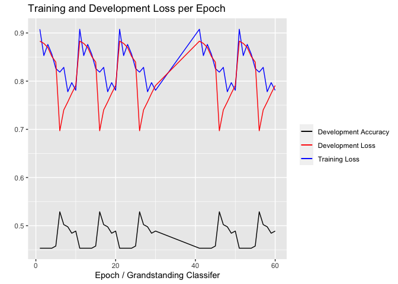

## <u>`flairR`</u>: An R Wrapper for Accessing Flair NLP Library 

[](https://github.com/davidycliao/flaiR/actions/workflows/r_macos.yml)
[](https://github.com/davidycliao/flaiR/actions/workflows/r_ubuntu.yaml)
[](https://github.com/davidycliao/flaiR/actions/workflows/r_window.yml)

[](https://github.com/davidycliao/flaiR/actions/workflows/r.yml)
[](https://github.com/davidycliao/flaiR/actions/workflows/test-coverage.yaml)
[](https://codecov.io/gh/davidycliao/flaiR)
[](https://www.codefactor.io/repository/github/davidycliao/flair)

<!-- README.md is generated from README.Rmd. Please edit that file -->

<div style="text-align: justify">

`{flaiR}` is an R wrapper for the
[{flairNLP/flair}](https://github.com/flairnlp/flair) library in Python,
designed specifically for R users, especially those in the social
sciences. It provides easy access to the main functionalities of
`{flairNLP}`. Developed by Developed by [Zalando
Research](https://engineering.zalando.com/posts/2018/11/zalando-research-releases-flair.html)
in Berlin, Flair NLP offers intuitive interfaces and exceptional
multilingual support, particularly for various embedding frameworks and
state-of-the-art natural language processing models to analyze your
text, such as named entity recognition, sentiment analysis,
part-of-speech tagging, biomedical data, sense disambiguation, and
classification, with support for a rapidly growing number of languages
in the community. For a comprehensive understanding of the
`{flairNLP/flair}` architecture, you can refer to the research article
‘[Contextual String Embeddings for Sequence
Labeling](https://aclanthology.org/C18-1139.pdf)’ and the official
[manual](https://flairnlp.github.io) written for its Python
implementation.

</div>

<br>

## Installation via <u>**`GitHub`**</u>

<div style="text-align: justify">

The installation consists of two parts: First, install [Python
3.8](https://www.python.org/downloads/) or higher (avoid developmental
versions and the very latest release for compatibility reasons).
Secondly, install [R 4.2.0](https://www.r-project.org) or higher.

**System Requirement:**

- Python (\>= 3.10.x)

- R (\>= 4.2.0)

- RStudio ***(The GUI interface allows users to adjust and manage the
  Python environment in R)***

- Anaconda ***(highly recommended)***

We have tested flaiR using CI/CD with GitHub Actions, conducting
integration tests across [various operating
syste](https://github.com/davidycliao/flaiR/actions) These tests include
intergration between R versions 4.2.1, 4.3.2, and 4.2.0 and Python
3.10.x. The testing also covers environments with flair NLP and PyTorch
(given that [Flair NLP](https://flairnlp.github.io) is built on
[Torch](https://pytorch.org)). For stable usage, we strongly recommend
installing these specific versions.

When first installed, {`flaiR`} automatically detects whether you have
Python 3.8 or higher. If not, it will skip the automatic installation of
Python and flair NLP. In this case, you will need to manually install it
yourself and reload {`flaiR`} again. If you have correct
Pythoninstalled, the {`flaiR`} will automatically install flair Python
NLP in your global environment. If you are using {reticulate}, {flaiR}
will typically assume the **r-reticulate** environment by default. At
the same time, you can use `py_config()` to check the location of your
environment. Please note that flaiR will directly install flair NLP in
the Python environment that your R is using. This environment can be
adjusted through *RStudio* by navigating to
**`Tools -> Global Options -> Python`**. If there are any issues with
the installation, feel free to ask in the
<u>[Discussion](https://github.com/davidycliao/flaiR/discussions) </u>.

First, understanding which Python environment your RStudio is using is
very important. We advise you to confirm which Python environment
RStudio is using. You can do this by checking with
`reticulate::py_config()` or manually via **Tools -\> Global Options -\>
Python**.

``` r
install.packages("reticulate")
reticulate::py_config()
```

At this stage, you’ll observe that RStudio has defaulted to using the
‘flair_env’ environment I have set up. Consequently, the Python Flair
package will be installed within this environment. Should you wish to
modify this setting, you have the option to either adjust it within
RStudio’s settings or utilize the {reticulate} package to manage the
Python environment in RStudio.

``` shell
#> python:         /Users/*********/.virtualenvs/flair_env/bin/python
#> libpython:      /Users/*********/.pyenv/versions/3.10.13/lib/libpython3.10.dylib
#> pythonhome:     /Users/*********/.virtualenvs/flair_env:/Users/*********/.virtualenvs/flair_env
#> version:        3.10.13 (main, Oct 27 2023, 04:44:16) [Clang 15.0.0 (clang-1500.0.40.1)]
#> numpy:          /Users/*********/.virtualenvs/flair_env/lib/python3.10/site-packages/numpy
#> numpy_version:  1.26.2
#> flair:          /Users/*********/.virtualenvs/flair_env/lib/python3.10/site-packages/flair

#> NOTE: Python version was forced by use_python() function
```

Now, you can confidently install flaiR in your R environment.

``` r
install.packages("remotes")
remotes::install_github("davidycliao/flaiR", force = TRUE)
```

You will notice the following message, indicating a successful
installation. This means that your RStudio has successfully detected the
correct Python and has installed Flair in your Python environment

``` r
library(flaiR)
#> flaiR: An R Wrapper for Accessing Flair NLP 0.13.0
```

<br>

</div>

## Introduction

<div style="text-align: justify">

For R users, {`flairR`} primarily consists of two main components. The
first is wrapper functions in {`flaiR`} built on top of {`reticulate`},
which enables you to interact directly with Python modules in R and
provides seamless support for documents and [tutorial (in
progress)](https://davidycliao.github.io/flaiR/articles/tutorial.html)
in the R community. The {flaiR} package enables R users to leverage
Flair’s capabilities to train their own models using the Flair framework
and state-of-the-art NLP models without the need to interact directly
with Python.

Flair offers a simpler and more intuitive approach for training custom
NLP models compared to using Transformer-based models directly. With
Flair, data loading and preprocessing are streamlined, facilitating the
easy integration of various pre-trained embeddings, including both
traditional and Transformer-based types like BERT. The training process
in Flair is condensed to just a few lines of code, with automatic
handling of fundamental preprocessing steps. Evaluation and optimization
are also made user-friendly with accessible tools. In addition, Flair
NLP provides an easy framework for training language models and is
compatible with HuggingFace.

Secondly, to facilitate more efficient use for social science research,
{`flairR`} expands {`flairNLP/flair`}’s core functionality for working
with three major functions to extract features in a tidy and fast
format–
[data.table](https://cran.r-project.org/web/packages/data.table/index.html)
in R.

</div>

#### **Performing NLP Tasks in R**

<div style="text-align: justify">

The expanded features (and examples) can be found:

- [**part-of-speech
  tagging**](https://davidycliao.github.io/flaiR/articles/get_pos.html)
- [**named entity
  recognition**](https://davidycliao.github.io/flaiR/articles/get_entities.html)
- [**transformer-based sentiment
  analysis**](https://davidycliao.github.io/flaiR/articles/get_sentiments.html)

In addition, to handle the load on RAM when dealing with larger corpus,
{`flairR`} supports batch processing to handle texts in batches, which
is especially useful when dealing with large datasets, to optimize
memory usage and performance. The implementation of batch processing can
also utilize GPU acceleration for faster computations.

</div>

<!-- #### __Apply a Transformer Model from HuggingFace__ -->
<!-- Use the policy agenda classifier trained by the Manifesto Project. You can find more details on [Manifesto Project HugginFace](https://huggingface.co/manifesto-project/manifestoberta-xlm-roberta-56policy-topics-context-2023-1-1). -->
<!-- ```{r} -->
<!-- # Load pre-trained model -->
<!-- library(flaiR) -->
<!-- TransformerDocumentEmbeddings <- flair_embeddings()$TransformerDocumentEmbeddings -->
<!-- Sentence <- flair_data()$Sentence -->
<!-- manifesto_tranformer = 'manifesto-project/manifestoberta-xlm-roberta-56policy-topics-sentence-2023-1-1' -->
<!-- classifier <- TransformerDocumentEmbeddings(manifesto_tranformer) -->
<!-- sentence <-  Sentence("your text here") -->
<!-- names(sentence$get_label) -->
<!-- length(sentence$get_embedding()) -->
<!-- sentence$get_embedding() -->
<!-- classifier$embed(sentence) -->
<!-- library(reticulate) -->
<!-- torch <- import("torch") -->
<!-- probabilities = torch$softmax(sentence$get_each_embedding()[[1]], dim=1)$tolist()[0] -->
<!-- torch$softmax(sentence$get_each_embedding()[[1]], dim=1L)$tolist()[0] -->
<!-- sentence$embedding$softmax() -->
<!-- # Correct model name without file path -->
<!-- model_name = 'manifesto-project/manifestoberta-xlm-roberta-56policy-topics-context-2023-1-1' -->
<!-- # Load the model -->
<!-- document_embeddings  <- TransformerDocumentEmbeddings(model_name) -->
<!-- # Example usage -->
<!-- sentence = Sentence("Your text to classify.") -->
<!-- document_embeddings.embed(sentence) -->
<!-- sentence$labels() -->
<!-- # Access the embedding -->
<!-- print(sentence.embedding) -->
<!-- # Create a sentence to classify -->
<!-- sentence <-  Sentence("your text here") -->
<!-- # Predict using the model -->
<!-- sentence$score() -->
<!-- print(sentence$embedding) -->
<!-- classifier$ek(sentence, verbose = TRUE) -->
<!-- ``` -->

#### **Training Models with HuggingFace via flaiR**

<div style="text-align: justify">

The following example offers a straightforward introduction on how to
fully train your own model using the Flair framework and import a `BERT`
model from [HuggingFace 🤗](https://github.com/huggingface). This
example utilizes grandstanding score as training data from Julia Park’s
paper (*[When Do Politicians Grandstand? Measuring Message Politics in
Committee
Hearings](https://www.journals.uchicago.edu/doi/abs/10.1086/709147?journalCode=jop&mobileUi=0)*)
and trains the model using Transformer-based models via flair NLP
through `{flaiR}`.

<u>**Step 1**</u> Split Data into Train and Test Sets with `flair`
Sentence Object

``` r
# load training data: grandstanding score from Julia Park's paper
library(flaiR)
data(gs_score) 
```

``` r
# load flair functions via flaiR
Sentence <- flair_data()$Sentence
Corpus <- flair_data()$Corpus
TransformerDocumentEmbeddings <- flair_embeddings()$TransformerDocumentEmbeddings
TextClassifier <- flair_models()$TextClassifier
ModelTrainer <- flair_trainers()$ModelTrainer
```

``` r
# split the data
text <- lapply(gs_score$speech, Sentence)
labels <- as.character(gs_score$rescaled_gs)

for (i in 1:length(text)) {
  text[[i]]$add_label("classification", labels[[i]])
}

set.seed(2046)
sample <- sample(c(TRUE, FALSE), length(text), replace=TRUE, prob=c(0.8, 0.2))
train  <- text[sample]
test   <- text[!sample]
```

<u>**Step 2**</u> Preprocess Data and Corpus Object

``` r
corpus <- Corpus(train=train, test=test)
#> 2023-11-22 05:03:31,474 No dev split found. Using 0% (i.e. 282 samples) of the train split as dev data
```

<u>**Step 3**</u> Create Classifier Using Transformer

``` r
document_embeddings <- TransformerDocumentEmbeddings('distilbert-base-uncased', fine_tune=TRUE)
```

``` r
label_dict <- corpus$make_label_dictionary(label_type="classification")
#> 2023-11-22 05:03:34,016 Computing label dictionary. Progress:
#> 2023-11-22 05:03:34,099 Dictionary created for label 'classification' with 2 values: 0 (seen 1334 times), 1 (seen 1200 times)
classifier <- TextClassifier(document_embeddings,
                             label_dictionary=label_dict, 
                             label_type='classification')
```

<u>**Step 4**</u> Start Training

specific computation devices on your local machine.

``` r
classifier$to(flair_device("mps")) 
#> TextClassifier(
#>   (embeddings): TransformerDocumentEmbeddings(
#>     (model): DistilBertModel(
#>       (embeddings): Embeddings(
#>         (word_embeddings): Embedding(30523, 768)
#>         (position_embeddings): Embedding(512, 768)
#>         (LayerNorm): LayerNorm((768,), eps=1e-12, elementwise_affine=True)
#>         (dropout): Dropout(p=0.1, inplace=False)
#>       )
#>       (transformer): Transformer(
#>         (layer): ModuleList(
#>           (0-5): 6 x TransformerBlock(
#>             (attention): MultiHeadSelfAttention(
#>               (dropout): Dropout(p=0.1, inplace=False)
#>               (q_lin): Linear(in_features=768, out_features=768, bias=True)
#>               (k_lin): Linear(in_features=768, out_features=768, bias=True)
#>               (v_lin): Linear(in_features=768, out_features=768, bias=True)
#>               (out_lin): Linear(in_features=768, out_features=768, bias=True)
#>             )
#>             (sa_layer_norm): LayerNorm((768,), eps=1e-12, elementwise_affine=True)
#>             (ffn): FFN(
#>               (dropout): Dropout(p=0.1, inplace=False)
#>               (lin1): Linear(in_features=768, out_features=3072, bias=True)
#>               (lin2): Linear(in_features=3072, out_features=768, bias=True)
#>               (activation): GELUActivation()
#>             )
#>             (output_layer_norm): LayerNorm((768,), eps=1e-12, elementwise_affine=True)
#>           )
#>         )
#>       )
#>     )
#>   )
#>   (decoder): Linear(in_features=768, out_features=2, bias=True)
#>   (dropout): Dropout(p=0.0, inplace=False)
#>   (locked_dropout): LockedDropout(p=0.0)
#>   (word_dropout): WordDropout(p=0.0)
#>   (loss_function): CrossEntropyLoss()
#> )
```

Start the training process using the classifier, which learns from the
data based on the grandstanding score.

``` r
trainer <- ModelTrainer(classifier, corpus)
```

<u>**Step 5**</u> Evaluate the Model

During and after the model training process, evaluating the performance
of the trained model on the development set is straightforward and easy.

``` r
# import the performance metrics generated during the training process
performance_df <- read.table(file = "./vignettes/classifier/loss.tsv", header = TRUE, sep = "\t")
head(performance_df)
#>   EPOCH TIMESTAMP LEARNING_RATE TRAIN_LOSS DEV_LOSS DEV_PRECISION DEV_RECALL
#> 1     1  00:25:18           0.1     0.9077   0.8829        0.4533     0.4533
#> 2     2  00:25:29           0.1     0.8530   0.8783        0.4533     0.4533
#> 3     3  00:25:39           0.1     0.8762   0.8698        0.4533     0.4533
#> 4     4  00:25:49           0.1     0.8562   0.8514        0.4533     0.4533
#> 5     5  00:25:59           0.1     0.8262   0.8394        0.4578     0.4578
#> 6     6  00:26:09           0.1     0.8187   0.6970        0.5289     0.5289
#>   DEV_F1 DEV_ACCURACY
#> 1 0.4533       0.4533
#> 2 0.4533       0.4533
#> 3 0.4533       0.4533
#> 4 0.4533       0.4533
#> 5 0.4578       0.4578
#> 6 0.5289       0.5289
```

``` r
library(ggplot2)
ggplot(performance_df, aes(x = EPOCH)) + 
  geom_line(aes(y = TRAIN_LOSS, color = "Training Loss")) +
  geom_line(aes(y = DEV_LOSS, color = "Development Loss")) +
  geom_line(aes(y = DEV_ACCURACY, color = "Development Accuracy")) +
  labs(title = "Training and Development Loss per Epoch",
       x = "Epoch / Grandstanding Classifer",
       y = "")  +
  scale_color_manual("", 
                     values = c("Training Loss" = "blue",
                                "Development Loss" = "red",
                                "Development Accuracy" = "Black"))
```



</div>

<br>

## Contribution and Open Source

<div style="text-align: justify">

`{flaiR}` is maintained and developed by [David
Liao](https://davidycliao.github.io) and friends. R developers who want
to contribute to {`flaiR`} are welcome – {`flaiR`} is an open source
project. I warmly invite R users who share similar interests to join in
contributing to this package. Please feel free to shoot me an email to
collaborate on the task. Contributions – whether they be comments, code
suggestions, tutorial examples, or forking the repository – are greatly
appreciated. Please note that the `flaiR` is released with the
[Contributor Code of
Conduct](https://github.com/davidycliao/flaiR/blob/master/CONDUCT.md).
By contributing to this project, you agree to abide by its terms.

The primary communication channel for R users can be found
[here](https://github.com/davidycliao/flaiR/discussions). Please feel
free to share your insights on the
[Discussion](https://github.com/davidycliao/flaiR/discussions) page and
report any issues related to the R interface in the
[Issue](https://github.com/davidycliao/flaiR/issues) section. If the
issue pertains to the actual implementation of Flair in Python, please
submit a pull request to the offical [flair
NLP](https://github.com/flairnlp/flair).

</div>

<br>
